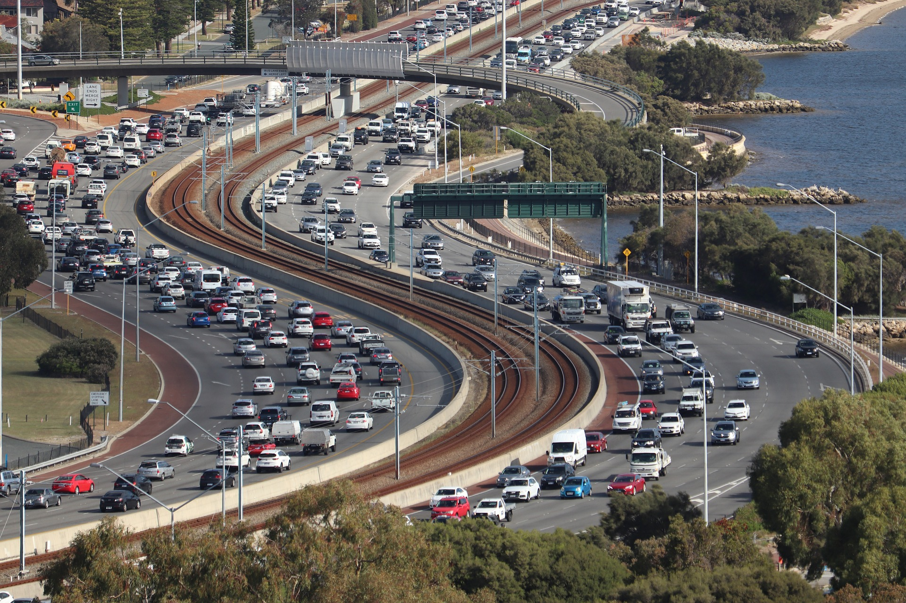

# Prediction of CO2 Emission of Vehicles

Image by <a href="https://pixabay.com/users/damoderndavinci-11004713/?utm_source=link-attribution&amp;utm_medium=referral&amp;utm_campaign=image&amp;utm_content=4567915">Shaun</a> from <a href="https://pixabay.com//?utm_source=link-attribution&amp;utm_medium=referral&amp;utm_campaign=image&amp;utm_content=4567915">Pixabay</a>

> This project follows the steps and methodology of predicting CO2 emissions. The features used in training the model were derived from the fuel consumption ratings data from 2010 to 2014 in Canada. Additionally, the report also explores the features that best classify the vehicles in the data set. 

---

### Table of Contents

- [Description](#description)
- [Training the model](#training-the-model)
- [Model Overfitting](#model-overfitting)
- [References](#references)
- [License](#license)
- [Author Info](#author-info)

---

## Description
### The Data
The data provided to achieve prediction and classification tasks, consists of 5360 rows and 13 columns. It includes the following features:
- Model Year
- Make
- Model
- Vehicle Class
- Engine Size
- Cylinders
- Transmission
- Fuel Type
- Consumption City
- Consumtion HWY
- Consumption Comb (L)
- Consumption Comb (mpg)
- CO2 Emissions

---

## Training the model
Training a machine learning model involves several steps. Here is a general outline of the process:

Data Collection and Preparation: Gather data from various sources and prepare it for analysis. This involves tasks such as cleaning the data, removing duplicates, handling missing values, and encoding categorical variables.

Data Exploration and Visualization: Explore the data to gain insights into the relationships between the variables. Use visualization techniques to understand the distribution of data and to identify patterns and outliers.

Feature Engineering: Identify the most important variables that can help predict the target variable. Create new variables that can better represent the data and improve the performance of the model.

Model Selection: Select the appropriate model that fits the problem at hand. This involves choosing an algorithm that is suitable for the data and the problem, such as regression, classification, clustering, or deep learning.

Model Training: Train the model on the data using an appropriate training algorithm. This involves finding the optimal values for the model's parameters by minimizing a loss function.

Model Evaluation: Evaluate the performance of the model on a separate validation dataset. This involves measuring the accuracy, precision, recall, F1-score, and other metrics that are appropriate for the problem.

Hyperparameter Tuning: Optimize the hyperparameters of the model to improve its performance. This involves selecting the best combination of hyperparameters that minimize the error on the validation dataset.

Model Deployment: Deploy the model in a production environment where it can be used to make predictions on new data. This involves creating an API or a web application that can receive inputs and return outputs.

Model Maintenance: Maintain the model over time to ensure its accuracy and relevance. This involves monitoring its performance, updating its parameters, and retraining it on new data if necessary.

These steps are iterative, and it may be necessary to go back and forth between them to improve the model's performance.

## Model Overfitting
For this task, cross validation, grid search, and train test split were all used in mitigating overfitting. 
Data augmentation: Data augmentation is a technique where additional data is created by applying transformations to the existing data. This can help prevent overfitting by increasing the amount of data available for training the model.

#### Technologies

- Python
- Jupyter Notebook
- Excel
- Matplotlib
- Seaborn
- Scikit-learn

[Back To The Top](#prediction-of-co2-emission-of-vehicles)

---

## References

- LinkedIn - [Mary-Ann Egbudom](https://www.linkedin.com/in/mary-ann-egbudom-9017b3109)
- Twitter - [@Rianne_egb](https://twitter.com/Rianne_egb)

[Back To The Top](#prediction-of-co2-emission-of-vehicles)

---

## License

MIT License

Copyright (c) [2022] [Mary-Ann Egbudom]

Permission is hereby granted, free of charge, to any person obtaining a copy
of this software and associated documentation files (the "Software"), to deal
in the Software without restriction, including without limitation the rights
to use, copy, modify, merge, publish, distribute, sublicense, and/or sell
copies of the Software, and to permit persons to whom the Software is
furnished to do so, subject to the following conditions:

The above copyright notice and this permission notice shall be included in all
copies or substantial portions of the Software.

THE SOFTWARE IS PROVIDED "AS IS", WITHOUT WARRANTY OF ANY KIND, EXPRESS OR
IMPLIED, INCLUDING BUT NOT LIMITED TO THE WARRANTIES OF MERCHANTABILITY,
FITNESS FOR A PARTICULAR PURPOSE AND NONINFRINGEMENT. IN NO EVENT SHALL THE
AUTHORS OR COPYRIGHT HOLDERS BE LIABLE FOR ANY CLAIM, DAMAGES OR OTHER
LIABILITY, WHETHER IN AN ACTION OF CONTRACT, TORT OR OTHERWISE, ARISING FROM,
OUT OF OR IN CONNECTION WITH THE SOFTWARE OR THE USE OR OTHER DEALINGS IN THE
SOFTWARE.

[Back To The Top](#prediction-of-co2-emission-of-vehicles)

---

## Author Info

- LinkedIn - [Mary-Ann Egbudom](https://www.linkedin.com/in/mary-ann-egbudom-9017b3109)
- Twitter - [@Rianne_egb](https://twitter.com/Rianne_egb)

[Back To The Top](#prediction-of-co2-emission-of-vehicles)
